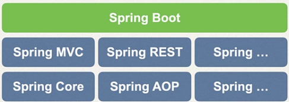
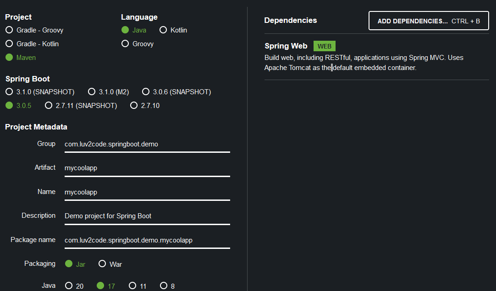
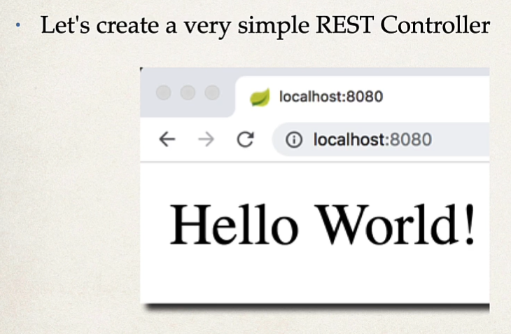

# Section 1: Spring Boot 3 - Quick Start

## 1.1 Spring Boot

### Overview

* Spring Boot simplifies the start up of a spring application. It minimises setup configuration including servers and dependency conflicts

* Has an embedded HTTP server, so we can use Tomcat straight away!

* We can use Spring Initializr to set up out project

### Running Spring Boot Apps

* We can run a Spring Boot application standalone using the jar file which is created

* You can also deploy a WAR file to an external server, the WAR file excludes the server configuration.


### FAQs

1) Does Spring boot replace Spring MVC, Spring Rest

A: No! Spring uses these depenendencies!



2) Is Spring Boot faster?

A: No!

<hr>

##  1.2 Sprint Boot Initializr Demo

### Maven Solution

* Maven can be used to download all the JAR dependencies we need!

### Spring Initiailizr

* I go to the Spring Initiailzr website [here](https://start.spring.io/)

* The dependencies I take is Spring Web.

* I have the following project setup:



* I unzip the folder into this directory [here](/Section%201%20-%20Spring%203%20Quick%20Start%20Guide/demo%201/mycoolapp/)

* I import in the project into eclipse!

### Code Demo

* I click `File -> Open` and select the POM of the unzipped file. I click the build icon and then `Right Click -> Run 'Mycoolappp...(main)`

```java
@SpringBootApplication
public class MycoolappApplication {

	public static void main(String[] args) {
		SpringApplication.run(MycoolappApplication.class, args);
	}

}
```

* I run the application:


* Going to localhost:8080 gives me:


<br>

##  1.3 Creating a REST Controller

* We will create a REST controller, so it will display:




