<link rel="stylesheet" href="../style.css" />

# 🟪 Section 1: Spring Boot 3 - Quick Start

# 🧠 1.1 Spring Boot

## 🟦 Overview

* Spring Boot simplifies the start up of a spring application. It minimises setup configuration including servers and dependency conflicts

* Has an embedded HTTP server, so we can use Tomcat straight away!

* We can use Spring Initializr to set up out project

## 🟦 Running Spring Boot Apps

* We can run a Spring Boot application standalone using the jar file which is created

* You can also deploy a WAR file to an external server, the WAR file excludes the server configuration.

    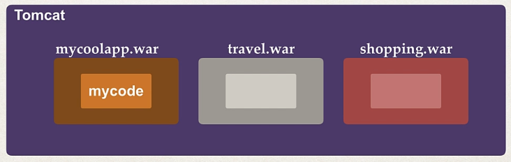

## 🟦 FAQs

1) **Does Spring boot replace Spring MVC, Spring Rest?**

    A: No! Spring uses these depenendencies!

    

2) **Is Spring Boot faster?**

    A: No!

<hr>

# 🧠 1.2 Sprint Boot Initializr Demo

## 🟦 Maven Solution

* Maven can be used to download all the JAR dependencies we need!

## 🟦 Spring Initiailizr

* I go to the Spring Initiailzr website [here](https://start.spring.io/)

* The dependencies I take is Spring Web.

* I have the following project setup:

    

* I unzip the folder into this directory [here](/Section%201%20-%20Spring%203%20Quick%20Start%20Guide/demo%201/mycoolapp/)

* I import in the project into eclipse!

## 🖥️ Code Demo 🖥️

* I click `File -> Open` and select the POM of the unzipped file. I click the build icon and then `Right Click -> Run 'Mycoolappp...(main)`

```java
    @SpringBootApplication
    public class MycoolappApplication {

        public static void main(String[] args) {
            SpringApplication.run(MycoolappApplication.class, args);
        }

    }
```

* I run the application:

    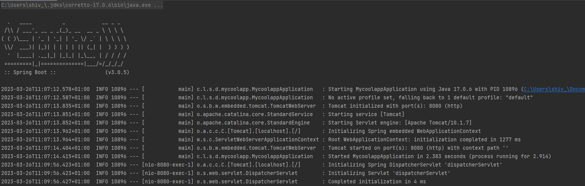

* Going to localhost:8080 gives me:

    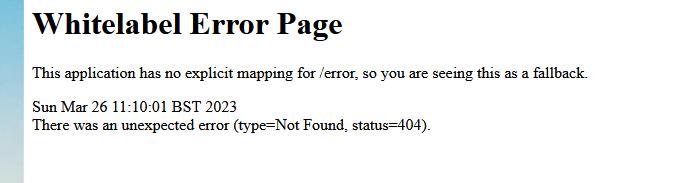

<br>

# 🧠 1.3 Creating a REST Controller

## 🟦 Plan

* We will create a REST controller, so it will display:

    

* The plan is:

    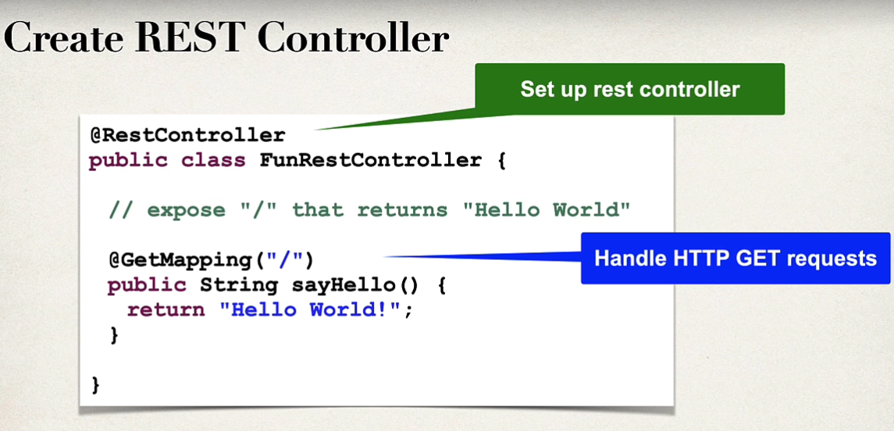

## 🖥️ Code Demo 🖥️

* I define a new package and class:


* I write the following:

```java
import org.springframework.web.bind.annotation.GetMapping;
import org.springframework.web.bind.annotation.RestController;

@RestController
public class FunRestController {

    @GetMapping("/")
    public String sayHello(){
        return "Hello World!";
    }
}
```

* I run my application from the main method. And go to localhost:8080/

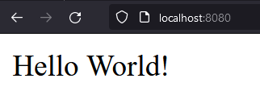

<br>

# 🧠 1.4 Spring Framework Overview

## 🟦 Goals of Spring

* Lightweight development with POJO

* Dependency injection to encourage loose-coupling

* Minimise boiler-plating

* AOP: add functionality such as logging, security and transactions in a declarative manner

* Support for TDD ans mocking objects outside of the container

## 🟦 Data Access Layer

* JDBC - reduces amount of code by 50%

* ORM - objection-relational mapping

* Transaction support on methods

<br>

# 🧠 1.5 Spring Projects

* These are additional modules built on top of the core Spring framework

* There are many projects such as cloud, data, security

<br>

# 🧠 1.6 What is Maven

* Spring Initializr can generate a Maven project for you

## 🟦 What is Maven?

* A popular tool for dependency and build management.

* Let's us download additional dependencies without manual intervention.

* Maven makes the JAR files available during compilation/run

## 🟦 How Maven works:

* Maven will look at your project configuration file

* It will check if your local repo, if it is not present it will download the dependencies from the Maven Central Repo and place it in your local repo!

* Maven will then use your local repo to build the project

    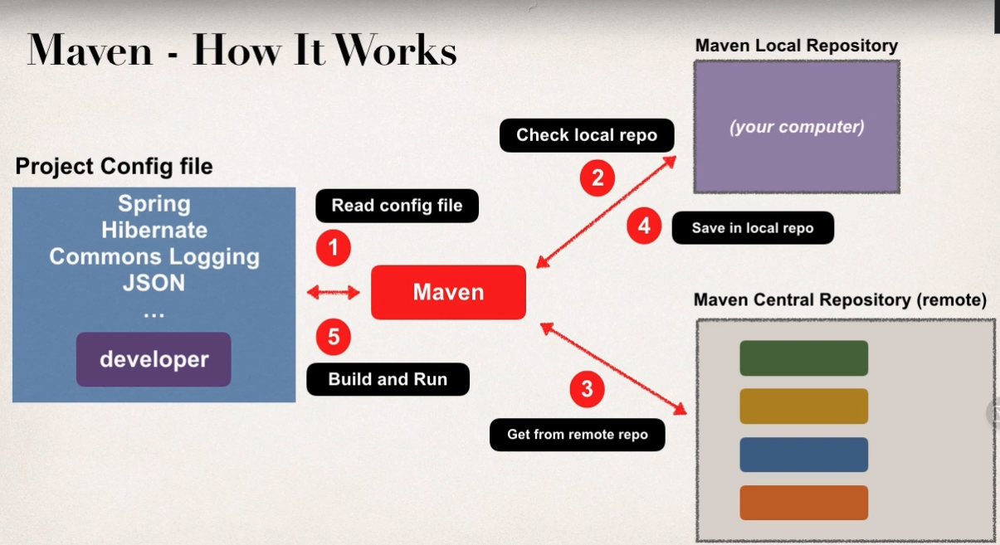

* Maven willa also download supporting dependencies for the dependencies!

* Maven will handle class/build path for you

<br>

# 🧠 1.7 Maven Project Structure

## 🟦 Project Structure

* Maven uses a standard project structure which encourages uniformity between developers!

* IDEs support Maven out the box, we can also move the project around different IDEs

    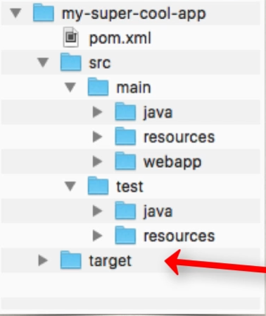

* Java code is stored in src/main/java

* Any web resources are placed in src/main/resources


## 🟦 POM File

* The POM is the Project Object Model file located in root of project! ✅

    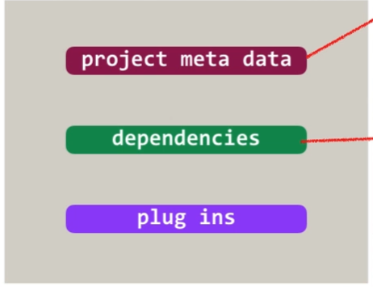

* The POM contains metadata (version, output file type), dependencies and custom task plugins

## 🟦 Simple POM File

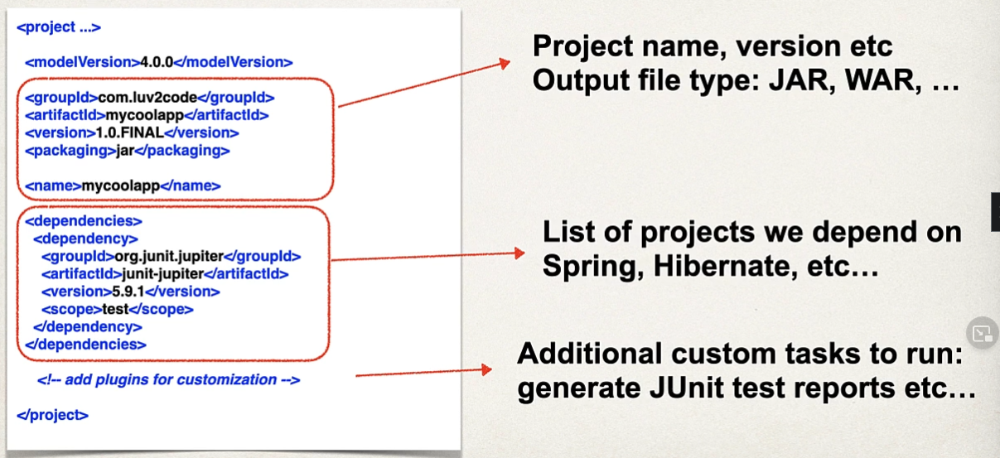

## 🟦 Project Coordinates

* A project coordinate is a way to uniquely identify a project.

* The project coordinate consists of:

    - **Group ID**: the name of organisation or company. E.g. `com.luv2code`

    - **Artifact ID**: the name of the project

    - **Version**: specific release version. E.g. `1.0` or `1.0-SNAPSHOT`

    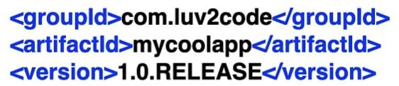


<br>

# 🧠 1.8 Spring Boot Project Files

## 🟦 The POM File:

* Looking at the POM from our code:

```xml
<dependencies>
    <dependency>
        <groupId>org.springframework.boot</groupId>
        <artifactId>spring-boot-starter-web</artifactId>
    </dependency>

    <dependency>
        <groupId>org.springframework.boot</groupId>
        <artifactId>spring-boot-starter-test</artifactId>
        <scope>test</scope>
    </dependency>
</dependencies>
```

* We can see we have starter dependencies which are a collection of Spring dependencies

* We also have the following plugins:

```xml
<plugins>
    <plugin>
        <groupId>org.springframework.boot</groupId>
        <artifactId>spring-boot-maven-plugin</artifactId>
    </plugin>
</plugins>
```

* We have a Maven plugin which enables us to download the dependencies using mvn in the command line! E.g.

```cmd
./mvn package
./mvn spring-boot:run
```

## 🟦 Application Properties

* Spring Boot will load properties from `application.properties` which is empty at the beginning!

    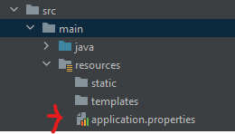

* Currently, it is an empty file 😲

* We COULD use this file to instruct which port number to use. E.g. by writing:

```properties
server-port:8089
```

## 🟦 Reading from Application Properties

* Suppose our application.properties is defined as:

    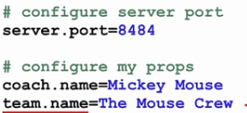

* Then we can access the values within our Java code like so:

```java
    @RestController
    public class FunRestController {
        @Value("${coach.name}") 
        private String coachName;
    }
```

## 🟦 Static Content

* Static resources like HTML, CSS, JavaScript, Images will be stored in the `src/main/resources/static` directory: 

    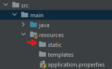

⚠️ Most build tools will ignore the `src/main/webapp` if you generate a **JAR** file. Works fine with WAR file ⚠️

## 🟦 Templates

* Spring Boot includes auto-configuration for template engines like `FreeMarker`, `Thymelead` and `Mustache`.

* By default Spring Boot will load templates from `src/main/resources/templates`

    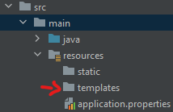

## 🟦 Unit Tests

* We can place our unit-testing files in `src/test/java`:

    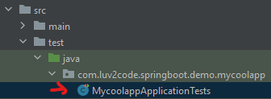

<br>

# 🧠 1.9 Spring Boot Starters

## 🟦 What is a Spring Boot Starter?

* 🎃 Spring Boot Starters are a **list of curated Maven dependencies** from the Spring Team which simplifies the problem for the developers of which Spring dependencies they should download!🎃

## Spring Boot Starter - Web

* Spring Boot provides one of these starters:

```xml
<dependency>
    <groupId>org.springframework.boot</groupId>
    <artifactId>spring-boot-starter-web</artifactId>
</dependency>
```

* This dependency contains:

    - spring-web
    - spring-webmvc
    - hibernate-validator
    - json
    - tomcat
    - ...

* ✅ To get this starter from spring.io, you just need to select the "Spring Web" dependency: ✅

&nbsp;&nbsp;&nbsp;&nbsp;&nbsp;&nbsp;&nbsp;&nbsp;&nbsp;&nbsp; 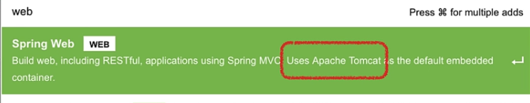

* ✅  We can view all the dependencies of our project in intelliJ by navigating to `View -> Tool Windows -> Maven -> Your project -> Dependencies` ✅

    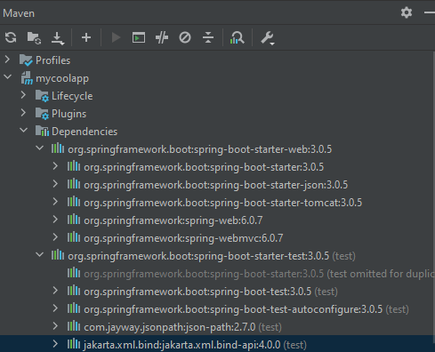

<br>

# 🧠 1.10 Spring Boot Starter Parent

## 🟦 What is a Spring Boot Starter Parent 

* 🎃 Spring Boot provides a Starter Parent - a special starter which provides Maven defaults 🎃

* We can see this near the top of our POM:

```xml
<parent>
    <groupId>org.springframework.boot</groupId>
    <artifactId>spring-boot-starter-parent</artifactId>
    <version>3.0.5</version>
    <relativePath/> <!-- lookup parent from repository -->
</parent>
```

* We can override a Maven default by specifying a property. E.g., we set the Java version to 17:

```xml
<name>mycoolapp</name>
<description>Demo project for Spring Boot</description>
<properties>
    <java.version>17</java.version>
</properties>
```


<br>

# 🧠 1.11 Spring Boot Dev Tools

## 😞 Problem: 😞

* If we make changes to our code, you must manually restart your application

## 😊 Solution: 😊

* Spring Boot Dev Tools will automatically restart your application when code is updated

* ✅ We just need to add the following dependency to our POM file! ✅

```xml
<dependency>
    <groupId>org.springframework.boot</groupId>
    <artifactId>spring-boot-devtools</artifactId>
</dependency>
```

* IntelliJ does not support spring-devtools by default

* We need to go to `Preferences > Build, Execution, Deployment > Compiler` and check `Build project automatically`

* Additionally, we must see the `Advance Settings` in `Preferences` and under `Compiler`, check the following:

    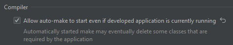

<br>

# 🧠 1.12 Spring Boot Dev Tools - Demo

* I create a new copy of Spring project [here](/Section%201%20-%20Spring%203%20Quick%20Start%20Guide/demo%203%20-%20Using%20spring%20dev%20tools/)

* I run the main method in intelliJ and verify spring dev tools is working!

* I add a new mapping in my FunRestController:

```java
// exposing a new endpoint for "workout"
    @GetMapping("/workout")
    public String getDailyWorkOut(){
        return "Run a hard 5k!";
    }
```

* The console shows that the server has restarted and navigating to localhost:8080/workout:

    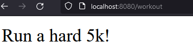

* Spring dev tools is working!!!

* I define another endpoint:

```java
    // exposing a new endpoint for "fortune"
    @GetMapping("/fortune")
    public String getDailyFortune(){
        return "Today is your lucky day!";
    }
```

<br>

# 🧠 1.13 Spring Boot Actuator


## 😞 Problem: 😞

* How do I monitory and manage the application, check the health and access the application metrics?

## 😊 Solution: 😊

* 🎃The Spring Boot Actuator exposes endpoints to monitor and manage your application.🎃

* ✅ In order to use the Spring Boot actuator, you need the following dependency ✅

```xml
<dependency>
    <groupId>org.springframework.boot</groupId>
    <artifactId>spring-boot-starter-actuator</artifactId>
</dependency>
```

* This will automatically expose new end-points which you can visit in the browser!

## 🟦 Health Endpoint

* 🎃 This endpoint gives health of application 🎃

* After adding the above dependency, I can navigate to localhost:8080/actuator/health. I get the following:

    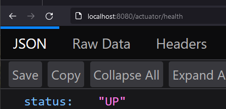

* This is exposed by default

## 🟦 Info Endpoint

* For the /info endpoint, we need to update our application.properties to include:

```properties
management.endpoints.web.exposure.include=health,info
management.info.env.enabled=true
```

* 🎃 The /info endpoint gives you information on your app. By default it returns empty 🎃

    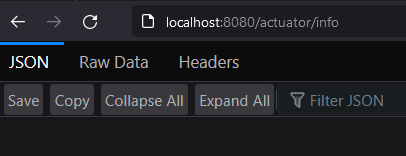

* ✅ We can specify the info to return by updating the properties ✅

* E.g., I add the following to my `application.properties` file:

```properties
info.app.name=Some cool application
info.app.description=A crazy and fun app!!!
info.app.version=1.0
```

* Going to the info endpoint now shows:

    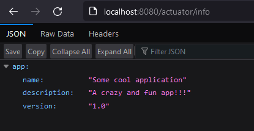

## 🟦 Spring Boot Actuator Endpoints

* There are 10+ Spring Boot Actuator Endpoints, these include:

    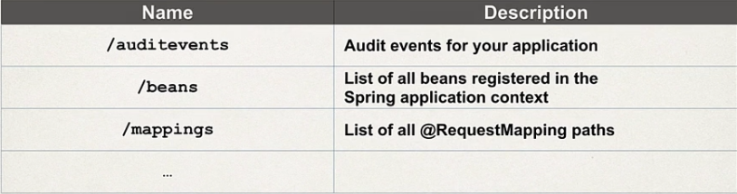

* 😏 We could expose all the actuator endpoints by using a wildcard in the `application.properties`:

```properties
management.endpoints.web.exposure.include=*
```

* We can then look at all the Beans using /actuator/beans endpoint!