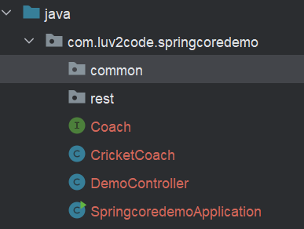

<link rel="stylesheet" href="../style.css" />

# 🟪 Section 2: Spring Boot 3 - Inversion of Control and Dependency Injection

# 🧠 2.1 Inversion of Conntrol

## 🟦 What is Inversion of Control

* 🎃This is the approach of outsourcing constructiona and management of objects🎃

## 🟦 Coding scenario

* Suppose we have an app which calls thge `getDailyWorkout()` from a `CricketCoach` class

* We want the app to be **configurable** and eaily change the coach for another support (e.g. Baseball, Hockey ... )

* The ideal solution would be my app calling an Object Factory! Spring provides us with this via the Spring Container

    

## 🟦 Spring Container

* The Spring Container has two roles:

1) Create and Manager Objects (Inversion of Control) ✅

2) Injecting object dependencies (Dependency Injection) ✅

## 🟦 Configuring Spring Container

* We can configure the Spring container in 3 ways:

1) XML Configuration (outdated) ❌

2) Java Annotations ✅

3) Java Source Code ✅

<br>


# 🧠 2.2 Spring Dependency Injections

* The dependency inversion principle states **the client delegates to another object the resposibility of providing its dependencies**

## 🟦 Demo Example

* We have a `DemoController` which wants to use the `Coach` class - the dependency!👀

    

* We shall **INJECT THE DEPENDENCY** into the controller

## 🟦 Injection Types

* We can inject a dependency in two ways:

1) Constructor Injection - recommended for required dependencies

2) Setter Injection - recommended for optional dependencies

## 🟦 Spring Autowiring

* Spring will look look for matches by type and inject automatically

## 🟦 Autowiring Example

* Spring will scan for `@Components`

* The `@Component` annotation makes a Java class into a Spring Bean

## 🖥️ Code Demo 🖥️

### Steps:

* We shall define an interface `Coach` with a `getDailyWorout()` method

* We will then create an implementation which overrides the `getDailyWorkout()` method

* We weill make a `DemoController` coach with a private `Coach` field.

* We will then have a constructor with the `@Autowired` annotation

* Finally, we expose an endpoint to display the `getDailyWorkout()` method

### Process

* I create a new Spring project on Spring initializr:


* I define a `Coach` interface:

```java
    public interface Coach {
        String getDailyWorkout();
    }
```

* I implement the interface with a `CricketCoach` class:

```java
@Component
public class CricketCoach implements Coach {

    @Override
    public String getDailyWorkout() {
        return "Practice fast bowling for 15 mins";
    }
}
```

* Note the use of `@Component`!

* I create a `DemoController`:

```java
@RestController
public class DemoController {

    private Coach coach;

    // depedency injection through constructor:
    @Autowired
    public DemoController(Coach theCoach){
        this.coach = theCoach;
    }

    @GetMapping("/dailyworkout")
    public String getDailyWorkout(){
        return coach.getDailyWorkout();
    }
}
```

* I run the Spring application:
    
    


<br>

## 📝 A Note about IDE Messages

* IntelliJ may complain that a Component is not being used:

    

* Since Spring is dynamic, the IDE does not know when a component is actually be used until run-time 

## 📝 Constructor Injection - Behind The Scenes

* How does spring inject the necessary dependencies? Behind the scene, Spring is instantiating the class and injecting it into the controller!

    

<br>

# 🧠 2.3  Component Scan

* Spring will automatically scan Java classes for annotations

* It will also register the bean automatically in the Spring Container

* The Java class with the main method has a `@SpringBootApplication` annotation - this enables auto configuration and component scanning

    


* The `@SpringBootApplication` annotation is composed of the following annotations:

1) `@EnableAutoConfiguration` - enables auto-configruation support

2) `@ComponentScan` - enables component scanning of current package and subpackages

3) `@Configruation` - allows registeration of extra bean with `@Bean` or other configuration classes

* The main method also has an import for `SpringApplication` which lets you run the Spring Boot application:

    

* We should place any components in the same package or subpackages of the SpringBootApplication!

* If we want to have components in other packages, we can define explicit packages to scan:

```java
    @SpringBootApplicastion(
        scanBasePackages={"com.luv2code.springcoredemo",
                        "com.luv2code.util",
                        "org.acme.cart",
                        "edu.cmu.srs"})
    public class SpringcoredemoApplication {
        // .... \\\
    }
```


## 🖥️ Code Demo 🖥️

* I created two sub packages:

    

    