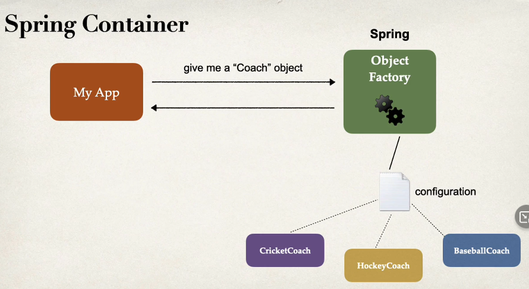

<link rel="stylesheet" href="../style.css" />

# 🟪 Section 2: Spring Boot 3 - Inversion of Control and Dependency Injection

# 🧠 2.1 Inversion of Conntrol

## 🟦 What is Inversion of Control

* 🎃This is the approach of outsourcing constructiona and management of objects🎃

## 🟦 Coding scenario

* Suppose we have an app which calls thge `getDailyWorkout()` from a `CricketCoach` class

* We want the app to be **configurable** and eaily change the coach for another support (e.g. Baseball, Hockey ... )

* The ideal solution would be my app calling an Object Factory! Spring provides us with this via the Spring Container

## 🟦 Spring Container

* The Spring Container has two roles:

1) Create and Manager Objects (Inversion of Control) ✅

2) Injecting object dependencies (Dependency Injection) ✅

## 🟦 Configuring Spring Container

* We can configure the Spring container in 3 ways:

1) XML Configuration (outdated) ❌

2) Java Annotations ✅

3) Java Source Code ✅