<link rel="stylesheet" href="../style.css" />

# 🟪 Section 2: Spring Boot 3 - Inversion of Control and Dependency Injection

# 🧠 2.1 Inversion of Conntrol

## 🟦 What is Inversion of Control

* 🎃This is the approach of outsourcing constructiona and management of objects🎃

## 🟦 Coding scenario

* Suppose we have an app which calls thge `getDailyWorkout()` from a `CricketCoach` class

* We want the app to be **configurable** and eaily change the coach for another support (e.g. Baseball, Hockey ... )

* The ideal solution would be my app calling an Object Factory! Spring provides us with this via the Spring Container

    

## 🟦 Spring Container

* The Spring Container has two roles:

1) Create and Manager Objects (Inversion of Control) ✅

2) Injecting object dependencies (Dependency Injection) ✅

## 🟦 Configuring Spring Container

* We can configure the Spring container in 3 ways:

1) XML Configuration (outdated) ❌

2) Java Annotations ✅

3) Java Source Code ✅

<br>


# 🧠 2.2 Spring Dependency Injections

* The dependency inversion principle states **the client delegates to another object the resposibility of providing its dependencies**

## 🟦 Demo Example

* We have a `DemoController` which wants to use the `Coach` class - the dependency!👀

    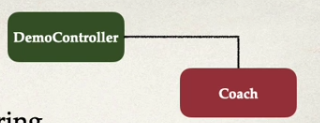

* We shall **INJECT THE DEPENDENCY** into the controller

## 🟦 Injection Types

* We can inject a dependency in two ways:

1) Constructor Injection - recommended for required dependencies

2) Setter Injection - recommended for optional dependencies

## 🟦 Spring Autowiring

* Spring will look look for matches by type and inject automatically

## 🟦 Autowiring Example

* Spring will scan for `@Components`

* The `@Component` annotation makes a Java class into a Spring Bean

## 🖥️ Code Demo 🖥️

### Steps:

* We shall define an interface `Coach` with a `getDailyWorout()` method

* We will then create an implementation which overrides the `getDailyWorkout()` method

* We weill make a `DemoController` coach with a private `Coach` field.

* We will then have a constructor with the `@Autowired` annotation

* Finally, we expose an endpoint to display the `getDailyWorkout()` method

### Process

* I create a new Spring project on Spring initializr:


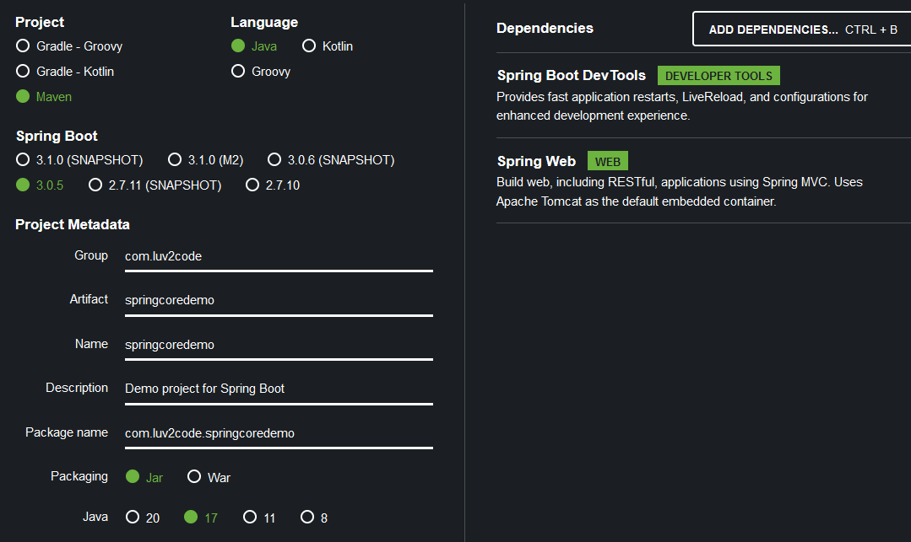

* I define a `Coach` interface:

```java
    public interface Coach {
        String getDailyWorkout();
    }
```

* I implement the interface with a `CricketCoach` class:

```java
@Component
public class CricketCoach implements Coach {

    @Override
    public String getDailyWorkout() {
        return "Practice fast bowling for 15 mins";
    }
}
```

* Note the use of `@Component`!

* I create a `DemoController`:

```java
@RestController
public class DemoController {

    private Coach coach;

    // depedency injection through constructor:
    @Autowired
    public DemoController(Coach theCoach){
        this.coach = theCoach;
    }

    @GetMapping("/dailyworkout")
    public String getDailyWorkout(){
        return coach.getDailyWorkout();
    }
}
```

* I run the Spring application:
    
    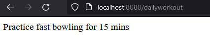


<br>

## 📝 A Note about IDE Messages

* IntelliJ may complain that a Component is not being used:

    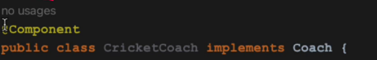

* Since Spring is dynamic, the IDE does not know when a component is actually be used until run-time 

## 📝 Constructor Injection - Behind The Scenes

* How does spring inject the necessary dependencies? Behind the scene, Spring is instantiating the class and injecting it into the controller!

    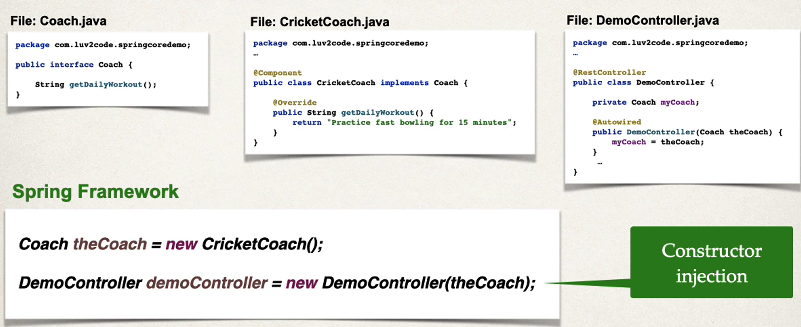

<hr>

# 🧠 2.3  Component Scan

* Spring will automatically scan Java classes for annotations

* It will also register the bean automatically in the Spring Container

* The Java class with the main method has a `@SpringBootApplication` annotation - this enables auto configuration and component scanning

    


* The `@SpringBootApplication` annotation is composed of the following annotations:

1) `@EnableAutoConfiguration` - enables auto-configruation support

2) `@ComponentScan` - enables component scanning of current package and subpackages

3) `@Configruation` - allows registeration of extra bean with `@Bean` or other configuration classes

* The main method also has an import for `SpringApplication` which lets you run the Spring Boot application:

    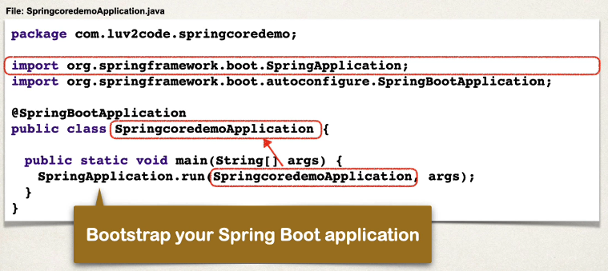

* We should place any components in the same package or subpackages of the SpringBootApplication!

* If we want to have components in other packages, we can define explicit packages to scan:

```java
    @SpringBootApplicastion(
        scanBasePackages={"com.luv2code.springcoredemo",
                        "com.luv2code.util",
                        "org.acme.cart",
                        "edu.cmu.srs"})
    public class SpringcoredemoApplication {
        // .... \\\
    }
```


## 🖥️ Code Demo 🖥️

* I created two sub packages:

    

* I moved the `Coach` and `CricketCoach` into the common package

* I move the `DemoController` into the rest package:

    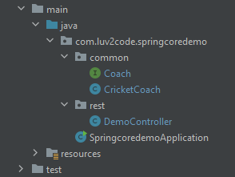


* I build and run my application, and it still works:

    

*  I move the `Coach` and `CricketCoach` into a package outside the springcoredemo package:

    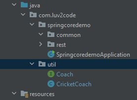

* I build and run my application and the application fails to start:

```console
Parameter 0 of constructor in com.luv2code.springcoredemo.rest.DemoController required a bean of type 'com.luv2code.util.Coach' that could not be found.
```

* We must explicitly define the base packages to pass!

* I add the `scanBasePackages` to the SpringcoredemoApplication:

```java
    @SpringBootApplication(scanBasePackages = {"springcoredemo", "util"})
    public class SpringcoredemoApplication {

        public static void main(String[] args) {
            SpringApplication.run(SpringcoredemoApplication.class, args);
        }

    }
```

* The application now runs without issue

*  I move everything back to where they were!


<hr>

# 🧠 2.4  Setter Injection

* Setter injection is injecting dependencies by calling the setter method of a class

* We configure the injection using `@Autowired` annotation

* We shall define a setter method `setCoach` in our DemoController and use the `@Autowired` annotation

* The Spring framework will:

    - Initialise the CricketCoach

    - Initialise the DemoController
    
    - Set the coach using the cricketCoach

* We are not limited to setters for dependency injection! 😱😱😱

* Constructor inject is best for required dependencies and setter injection is best for optional dependencies


## 🖥️ Code Demo 🖥️

* I remove the old constructor injection from my DemoController:

```java
@RestController
public class DemoController {

    private Coach coach;

    // Setter injection:
    @Autowired
    public void setCoach(Coach theCoach){
        coach = theCoach;
    }

    @GetMapping("/dailyworkout")
    public String getDailyWorkout(){
        return coach.getDailyWorkout();
    }
}
```

* Again the application is still working! This confirms the app is utilising the setter injection

* Even if we renamed the setter injection, the app will still function!!

```java
    // Setter injection:
    @Autowired
    public void injectMyDependency(Coach theCoach){
        coach = theCoach;
    }
``` 


<hr>

# 🧠 2.5 Field Injection

* Field injection is discouraged by Spring team! This makes code harder to unit test. This is popular in legacy code

* 🎃Field injection is injecting dependencies by setting fields on your class directly - including private fields!🎃

* This is achieved via Java Reflection❗❗❗

* Field injection works by just applying the `@Autowired` annotation to a field:

```java
@RestController
public class DemoController {

    @Autowired
    private Coach coach

    // no need for setter or constructor

    //...
}
```

<hr>

# 🧠 2.6 Qualifiers

* Suppose we have multiple classes with the `@Component` annotation. Which one does spring inject? 🤔

* Suppose we have 4 different components:

    1) baseballCoach
    2) cricketCoach
    3) tennisCoach
    4) trackCoach

* If we attempt to run the application, we get the following error:

    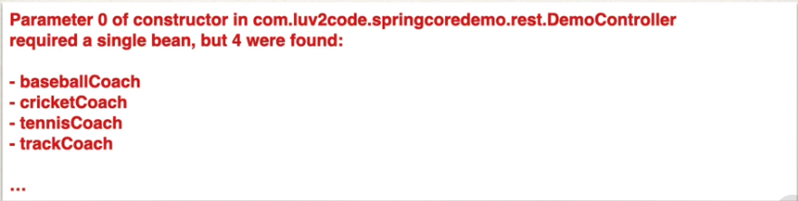

* We can get around this using the `@Qualifier` annotation by specifying the bean ID:

```java
@RestController
public class DemoController {
    private Coach myCoach;

    // Constructor Injection: 
    @Autowried
    public DemoController(@Qualifier(" cricketCoach") Coach theCoach){
        myCoach = theCoach
    }

    // ....
}
```

* The bean ID is always the name of the component but the first character is lower case. 

* We can also use `@Qualifier` for setter injection:

```java
@RestController
public class DemoController {

    private Coach myCoach;

    // Setter injection:
    @Autowired
    public void setCoach(@Qualifier("cricketCoach") Coach theCoach){
        myCoach = theCoach;
    }
}
```


## 🖥️ Code Demo 🖥️

* I define 3 other coached which implement the `Coach` class:

    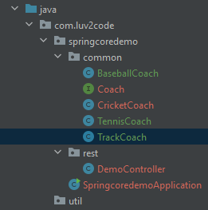

* Running the application fails:

```console
***************************
APPLICATION FAILED TO START
***************************

Description:

Parameter 0 of constructor in com.luv2code.springcoredemo.rest.DemoController required a single bean, but 4 were found:
	- baseballCoach: defined in file 
	- cricketCoach: defined in file 
	- tennisCoach: defined in file 
	- trackCoach: defined in file 

Action:

Consider marking one of the beans as @Primary, updating the consumer to accept multiple beans, or using @Qualifier to identify the bean that should be consumed


Process finished with exit code 0
```

* I add the `@Qaulifier` annotation to the DemoController's constructor:

```java
    @Autowired
    public DemoController(@Qualifier("baseballCoach") Coach theCoach){
        coach = theCoach;
    }
```

* Running the application works😊😊😊:

    


<hr>

# 🧠 2.7 Primary

* 🎃We can use the `@Primary` annotation on a Coach who we want to be our primary implementation to use🎃

*  ❌You can not mark multiple classes with `@Primary`❌

* Qualifier has higher priority!

## 🖥️ Code Demo 🖥️

* I remove the `@Qualifier` from the DemoController:

```java
    @Autowired
    public DemoController(Coach theCoach){
        coach = theCoach;
    }
```

* I add the `@Primary` annotation to TennisCoach:

```java
    @Component
    @Primary
    public class TennisCoach implements Coach{

        @Override
        public String getDailyWorkout() {
            return "Practice your volley!";
        }
    }
```

* Running the application:

    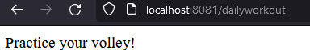


<hr>

# 🧠 2.8 Lazy Initialisation

* By default, all beans with `@Component` will be initialised!

* 🎃`@Lazy` initialisation ensures that a bean is only initialised if needed for injection or explicitly requested🎃

* We can make ALL beans lazy initialised by setting the following property to true:

```properties
spring.main.lazy-initialization=true
```

## 🖥️ Code Demo 🖥️

* I add a message to be printed for each of the Coach classes:

```java
 public someCoach(){ // BaseballCoach, CricketCoach ... etc
        System.out.println("in constructor"+
                getClass().getSimpleName());
    }
```

* I also add the same message to the DemoController's constructor:

```java
 @Autowired
    public DemoController(@Qualifier("cricketCoach") Coach theCoach){
        System.out.println("in constructor"+getClass().getSimpleName());
        coach = theCoach;
    }
```

* When running the application, we get the following in console:

    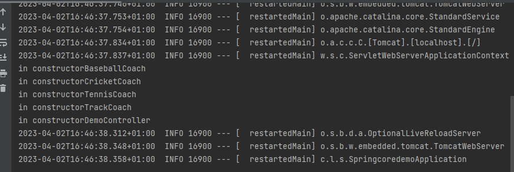

* I add the `@Lazy` annotation to the TrackCoach class:

```java
    @Component
    @Lazy
    public class TrackCoach implements  Coach{

        public TrackCoach(){
            System.out.println("in constructor"+
                    getClass().getSimpleName());
        }
        // ...
}
```

* Rerunning the application gives the following:

    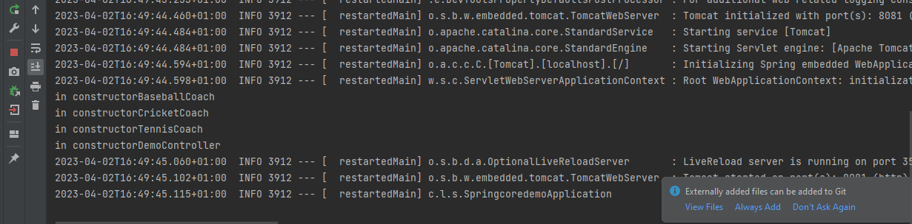

* Let's set it globally to ensure lazy initialisation in our application.properties:

```properties
server.port=8081
spring.main.lazy-initialization=true
```

* The console shows:

    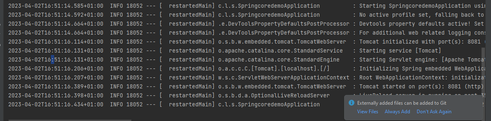

* When we go to `http://localhost:8081/dailyworkout`, the console updates to:

    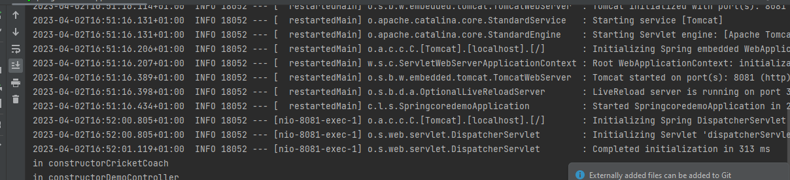

<hr>

# 🧠 2.9 Bean Scope

* 🎃Bean scope refers to lifeycle to the bean, how long it lives, how many instances are created and how is the bean shared🎃

## Default Scope

* The default scope for beans is **SINGLETON**

* A Singleton means that the Spring Container creates on a single instance of the bean. It is cached in memory and all dependency injections will reference the same bean

* E.g. suppose we were injecting the CricketCoach in two places:

    

* We can explicitly define the scope of a bean using the `@Scope` annotation✅

```java
@Component
@Scope(ConfigurableBeanFactory.SCOPE_SINGLETON)
public class CricketCoach implements Coach {
    // ...
}
```

## Additional Spring Bean Scopes:

1) **singleton**: single shared instance of bean

2) **prototype**: creates a new bean instal for each container request

3) **request**: scope to a HTTP web request

4) **session**: scoped to HTTP web session

5) **global-session**: scoped to global HTTP web session

## Prototype Scope Example

```java
@Component
@Scope(ConfigurableBeanFactory.SCOPE_PROTOTYPE)
public class CricketCoach implements Coach {
    // ...
}
```

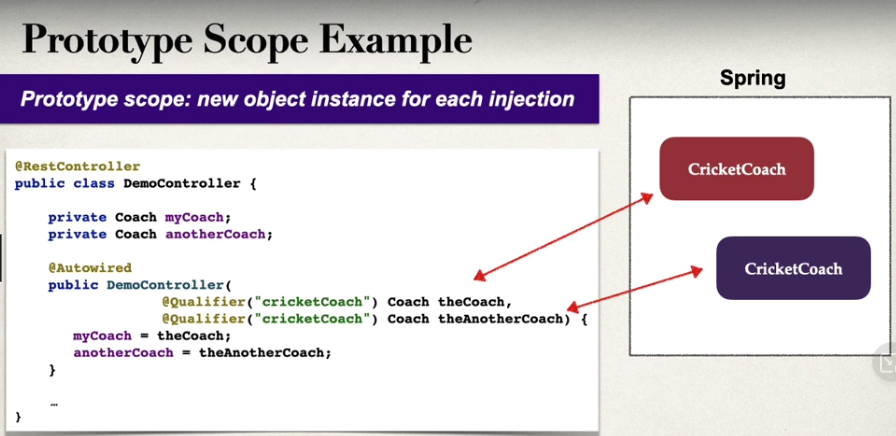


## 🖥️ Code Demo 🖥️

* I add another Coach field to the DemoController:

```java
@RestController
public class DemoController {

    private Coach coach;
    private Coach anotherCoach;


    @Autowired
    public DemoController(@Qualifier("cricketCoach") Coach theCoach, @Qualifier("cricketCoach") Coach anotherCoach){
        System.out.println("in constructor"+getClass().getSimpleName());
        coach = theCoach;
        this.anotherCoach = anotherCoach;
    }

    // ...
}
```

* I add a new get mapping which checks if the two fields are the same:

```java
    @GetMapping("/check")
    public String check(){
        return "Comparing beans: coach==anotherCoach "+ (coach==anotherCoach);
    }
```

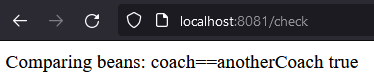

* We can see the coaches are the same

* Let's change the bean scope for CricketCoach to prototype:

```java
    @Component
    @Scope(ConfigurableBeanFactory.SCOPE_PROTOTYPE)
    public class CricketCoach implements Coach {

        public CricketCoach(){
            System.out.println("in constructor"+
                    getClass().getSimpleName());
        }
```

* Rerunning the app:

