<link rel="stylesheet" href="../style.css" />

# 🟪 Section 3 - Spring Boot 3 - Database Access with Hibernate/JPA CRUD

# 🧠 3.1 Introduction

## 🟦 Overview

We shall go through the following topics:

1) What is Hibernate? 🤔

2) Benefits of Hibernate 😊 

3) What is JPA? 🤔

4) Benefits of JPA 😊 

## 🟦 What is Hibernate? 🤔

* 🎃 **Hibernate is a framework for persisting Java objects to a database** 🎃

* It's a very popular framework used by enterprise applications:

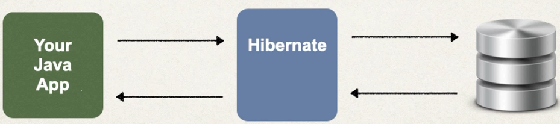

## 🟦 Benefits of Hibernate 😊

* Handles all low level SQL code ✅
* Minimises amount of JDBC code needed ✅
* It provides the Object-to-Relational Mapping (ORM) ✅

## 🟦 How does Hibernate work?? 🤔

* The developer simply defines the mapping between the Java class and database table:

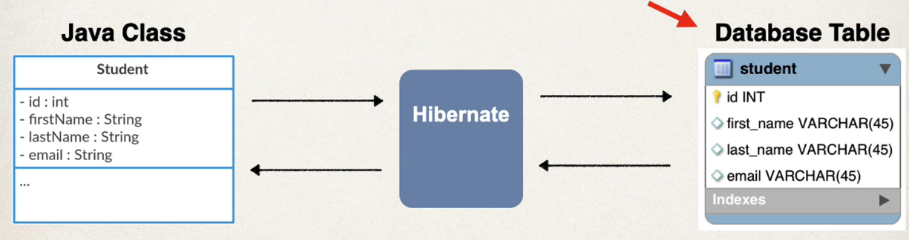

* These mappings can be made through XML, Java code or annotations

## 🟦 What is JPA? 🤔

* 🎃 **JPA is Jakarta Persistence API (previously Java Persistence API). It defines a set of interfaces and acts as a standard API for ORM** 🎃

* JPA Vendor Implementations are frameworks which provide implementation for JPA. Hibernate and EclipseLink are both JPA implementations

## 🟦 Benefits of JPA 😊

* A standard API means you are not locked to a specific vendor, so you can switch implementations✅
* This maintains portability and flexibility of code ✅
* It provides the Object-to-Relational Mapping (ORM) ✅


## 🟦 Saving Java Object with JPA 🤔

* Here's some code to persist to the database:

```java
// create Java object
Student student = new Student("Shiv", "Kumar", "shiv@email.com");

// save to database
entityManager.persist(student);
```

* The `entityManager` is a JPA helper object which has methods which execute SQL queries on the database❗

## 🟦 Retrieving a Java Object with JPA 🤔

* Here's some code to persist to the database:

```java
// retrieve from database using primary key:
int theId = 1;
Student myStudent = entityManager.find(Student.class, theId);
```

## 🟦 Querying for Java Objects 🤔

* Here's some code for querying Java objects from the DB:

```java
TypedQuery<Student> query = entityManager.query("FROM Students", Student.class);
List<Student> listOfStudents = query.getResultList();
```

## How does Hibernate/JPA relate to JDBC?

* Hibernate/JPA uses JDBC for all database communications, its another layer of Abstraction!

<br>

# 🧠 3.2 Setting Up Database Table

* I download MySQL Server using the Windows installer

 * We shall setup the database using some starter files:

    1) `01.create-user.sql`

    2) `02-student-tracker.sql`

* I take the folder [00-starter-sql-scripts](/00-starter-sql-scripts/) and copy it to a new demo folder ([here](/demo-01-spring-hibernate-jpa-crud/))

* I open up the create user sql in MySQL workbench and executre the script.

* I can see the new user in the admin and privelleges page:

    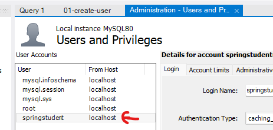

* I create a new connection for the springstudent connection, and succesfully test the connection:

    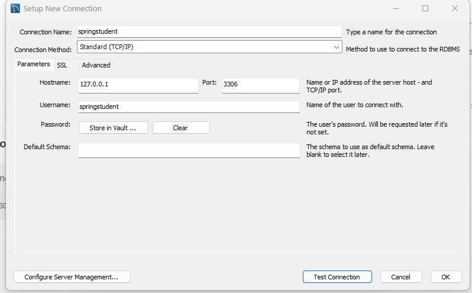

* I use the new connection, I look at the schema:

    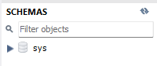

* I open up the student tracker SQL script and execute it. Checking the schema now:

    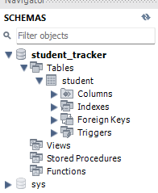

* The database is now setup!!!

<br>

# 🧠 3.3 Setting Up Spring Boot Project

## 🟦 Automatic Data Source Configuration

* ❗Hibernate is the default implementation of JPA❗

* `EntityManager` from JPA is the main component for creating enquiries ✅

* Based on configuration, Spring will create beans for `DataSource` and `EntityManager`

* These can be injected into the app

## 🟦 Setting Up Project

* We shall use Spring Intitialzr to add dependencies for:
    
    - MySQL Driver `mysql-connecter-j` 👷
    - Spring Data JPA `spring-boot-starter-data-jpa` 👷

* Spring Boot will automatically configure data source for you and get the DB connection info from `application.properties` - which will contain url, username and passeword

* We shall make a simple command line app to focus on JPA/Hibernate

## 🟦 Code Demo

* I go to spring initialzr and create the following project:


* I unzip the code folder [here](/demo-01-spring-hibernate-jpa-crud/)

* I open up `CrudDemoApplication`:

```java
@SpringBootApplication
public class CrudDemoApplication {

	public static void main(String[] args) {
		SpringApplication.run(CrudDemoApplication.class, args);
	}

}
```

* I create a new Bean `CommandLineRunner` (from Spring Boot):

```java
@SpringBootApplication
public class CrudDemoApplication {
	public static void main(String[] args) {
		SpringApplication.run(CrudDemoApplication.class, args);
	}
	@Bean
	public CommandLineRunner commandLineRunner(String[] args){
		return runner -> {
			System.out.println("Hello World");
		};
	}
}
```


* I update the `application.properties`:

```properties
# the port number comes from the connection in MySQL
spring.datasource.url=jdbc:mysql://localhost:3306/student_tracker
spring.datasource.username=springstudent
spring.datasource.password=springstudent
```

* We can see that the application is running:

    

* ❗ We can switch off the spring boot banner from displaying in console with an additional property. We can also set the logging level to warn ❗

```properties
# disable spring banner
spring.main.banner-mode=off

# reduce logging level
logging.level.root=warn
```

<br>

# 🧠 3.4 JPA Annotations

* We shall map a Java class to a database table. The Java class will be a `Student` class with id, firstName, lastName, email fields

## 🟦 Entity Class

* The entity class must be annotated with `@Entity`❗ and must have public or protected no-argument constructor❗ (there can be other constructors)

## 🟦 Annotations

* `@Entity` - we declare this above the class we wish to map✅ If the database table has a different name to the class then we can use the `@Table` annotation to specify the DB table name😱

* `@Column` is used to map a field of the class to the column✅ We can specify the name of the database column explicitly using `name` in brackets

* ⚠️ The `@Column` annotation is completely optional if the table name is the same as the field name - however this is discouraged ⚠️

## 🟦 Primary Key

* 🎃A primary key is a unique, non-null value which can be used to reference a single column🎃

## 🟦 MySQL Auto Increment

* We can make use of `AUTO_INCREMENT` in MySQL such that the column will always have a generated unique value✅ This is especially useful for primary keys😊

```sql
CREATE TABLE student {
	id INT NOT NULL AUTO_INCREMENT,
	// ... ,
	PRIMARY KEY(id)
}
```

## 🟦 JPA Identity - Primary Key

* JPA has a `@GeneratedValue` annotation allows us to enable the database to handle generation of this column. We specify the strategy in brackets:

```java
public class Student {

	@Id
	@GeneratedValue(strategy=GenerationType.AUTO)
	@Column(name="id")
	private int id;

	//...
}
```

### 🟥 Generation Strategy

* We have the following strategies:

| Name					| 	Description		|
| --------------------- | ----------------- |
| `GenerationType.AUTO`	|	Picks appropiate strategy for particular database |
| `GenerationType.IDENTITY` | Assigns primary keys using DB identity column |
| `GenerationType.SEQUENCE`  | Assigns primary keys using a database sequence |
| `GenerationType.TABLE`     | As


😱 You can define your own generation strategy by creating an implementation of `org.hibernate.id.IdentifierGenerator` and overriding the `generate()` method 😱


<hr>

## 👨‍💻 Coding Demo 👨‍💻

* I create a new package called `entity` and create a `Student` class in it:


* I define the class as:

```java
@Entity
@Table(name="student")
public class Student {

    @Id
    @GeneratedValue(strategy = GenerationType.IDENTITY)
    @Column(name="id")
    private int id;

    @Column(name = "first_name")
    private String firstName;

    @Column(name = "last_name")
    private String lastName;

    @Column(name = "email")
    private String email;

    // defining constructors
    public Student() {}
    public Student(String firstName, String lastName, String email) {
        this.firstName = firstName;
        this.lastName = lastName;
        this.email = email;
    }
    
    // define getters and setters:
	// Getters and Setters here!
    
    // toString implementation
    @Override
    public String toString() {
        return "Student{" + "id=" + id + ", firstName='" + firstName + '\'' + ", lastName='" + lastName + '\''
                + ", email='" + email + '\'' + '}';
    }
}
```

<br>

# 🧠 3.5 Saving a Java Object with JPA

## 🟦 Student Data Access Object

* Data Access Object (DAO) is a 😱design pattern😱 in which an object is responsible for interfacing with the database:

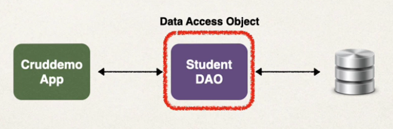

* Our Student DAO will have the following methods:

| Methods   		|
| ----------------- |
| `save(...)` ✅  	 		|
| `findById(...)` ✅ 		|
| `findAll(...)` ✅		|
| `findByLastName(...)` ✅ |
| `update(...)` ✅		|
| `delete(...)` ✅		|
| `deleteAll(...)` ✅	|

* This DAO will need a JPA Entity Manager❗

## 🟦 JPA Entity Manager

* The JPA Entity Manager needs a Data Source❗

* The Data Source defines database connection info🤔

* JPA Entity Manager and Data Source are automatically created By Spring Boot - base on application.properties

* We can then inject/autowire the JPA Entity Manager into the Student DAO😱

## 🟦 Plan

### 🟥 StudentDAO and StudentDAOImpl

* We shall define a `StudentDAO` interface which contains a `save()` method which saves a student passed into it✅

* We shall then define an implementation - `StudentDAOImpl` which injects the `EntityManager` and uses it to persist the student object to the database✅

### 🟥 Spring @Transactional Annotation

* 🎃Spring provide the `@Transactional` annotation which will automatically begin and end a transaction for your JPA code🎃 

* We shall use this annotation for our `save()` method in our StudentDAOImpl class✅

### 🟥 Spring @Repository Annotation

* Spring provides the `@Repository` annotation which is a "sub" annotation of `@Component`

* This will register the class its applied as a bean automatically thanks to component scanning✅

* 🎃`@Repository` provides translations for any JDBC related exception🎃

* We shall apply this annotation to our `StudentDAOImpl` class✅

### 🟥 Update the Main App

* We shall inject the `StudentDAO` into the `CommandLineRunner` and write code which creates a Student object and then save it to the database while logging to the console!✅

<hr>

## 👨‍💻 Coding Demo 👨‍💻

* I create a `dao` package:

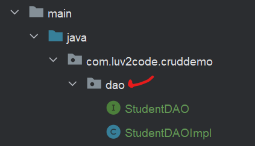

* I define a `StudentDAO` interface:

```java
public interface StudentDAO {
    void save(Student student);
}
```

* I implement the interface with `StudentDAOImpl`:

```java
@Repository
public class StudentDAOImpl implements StudentDAO {
    private EntityManager entityManager;
    public StudentDAOImpl(EntityManager entityManager){
        this.entityManager = entityManager;
    }
    @Override
    @Transactional
    public void save(Student student) {
        entityManager.persist(student);
    }
}
```

* ⚠️Without the `@Transactional` annotation, the application will fail when attempting to persist to the database⚠️

* I then update the `CrudDemoApplication` class

```java
@SpringBootApplication
public class CrudDemoApplication {

	public static void main(String[] args) {
		SpringApplication.run(CrudDemoApplication.class, args);
	}

	@Bean
	public CommandLineRunner commandLineRunner(StudentDAO studentDAO){
		return runner -> {
			saveStudent(studentDAO);
		};
	}

	private void saveStudent(StudentDAO studentDAO) {
		System.out.println("Defining a student: ");
		Student student = new Student("Shiv", "Kumar","email.com");
		System.out.println(student.toString());

		System.out.println("Saving to database: ");
		Student tempStudent = student;
		studentDAO.save(tempStudent);

		System.out.println("Saved student. ID: "+tempStudent.getId());
		}
}
```

* Running the application, I see the following in my console:

	

* Looking at MySQL, the student table returns:

	


<br>

# 🧠 3.6 Primary Keys

* Looking at the makeup of the `student` table in MySQL:

	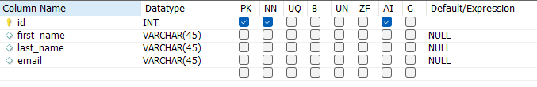

* We shall see the behaviour of the Autoincremented valye by writing some additional code in our application!

* I comment out the coe which saves a single student in my `CrudDemoApplication` class and define a new method:

```java
	@Bean
	public CommandLineRunner commandLineRunner(StudentDAO studentDAO){
		return runner -> {
			// saveStudent(studentDAO);

			createMultipleStudents(studentDAO);
		};
	}
```

* I define the `createMultipleStudents()` method as'

```java
	private void createMultipleStudents(StudentDAO studentDAO) {
		System.out.println("Creating 3 student objects: ");
		Student tempStudent1 = new Student("Shiv", "Kumar","email.com");
		Student tempStudent2 = new Student("John", "Doe","email.com");
		Student tempStudent3 = new Student("Mark", "Jones","email.com");

		System.out.println("Saving the students: ");
		studentDAO.save(tempStudent1);
		studentDAO.save(tempStudent2);
		studentDAO.save(tempStudent3);

	}
```

* Running the application:

	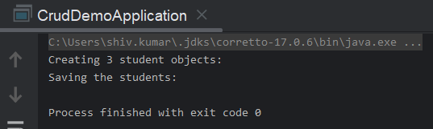

* Looking at the database:

	


<br>

# 🧠 3.7 Changing Index of MySQL Auto Increment

* We can alter the database such that the starting value of the auto-increment index is different:

	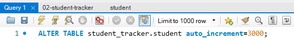

* Re-running the application

	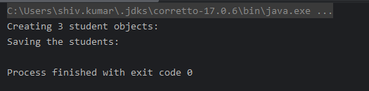

* Looking at the database:

	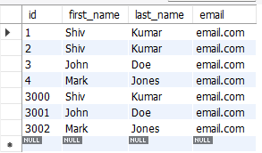

* How could we reset the index such that it starts at 1?🤔 We can use the `TRUNCATE` command in MySQL which will delete everything from the table and restart the index:

	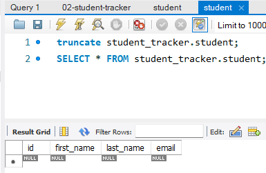

* Re-running the application and quirying the table again:

	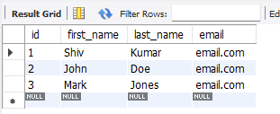


<br>

# 🧠 3.8 Reading Objects with JPA

## 🟦 Plan

* We've seen how to create objects, we shall now see how to retrieve an object

* JPA has a method to find an object using entityManager and calling the `find()` method which accepts the entity class and primaryy key:

```java
Student student = entityManager.find(Student.class, 1); // returns null if not found
```

* We shall add a new method to the `StudentDAO` interface `Student findById(Integer id)` and implement this method in `StudentDAOImpl`

* We shall then update the main app which will create a student, save it, find its primary key and then retrieve it

## 👨‍💻 Coding Demo 👨‍💻

*  I updated the `StudentDAO` interface:

```java
public interface StudentDAO {

    void save(Student student);

    Student findById(Integer id); // new method
}
```

* I update the `StudentDAOImpl` implementation:

```java
@Repository
public class StudentDAOImpl implements StudentDAO {

   // ...

    @Override
    public Student findById(Integer studentId){
        return entityManager.find(Student.class, studentId);
    }
}
```

* I then changed the code in the `CrudDemoApplication` class:

```java

@SpringBootApplication
public class CrudDemoApplication {

	public static void main(String[] args) {
		SpringApplication.run(CrudDemoApplication.class, args);
	}

	@Bean
	public CommandLineRunner commandLineRunner(StudentDAO studentDAO){
		return runner -> {
			// saveStudent(studentDAO);
			// createMultipleStudents(studentDAO);
			findStudent(studentDAO);
		};
	}

	private void findStudent(StudentDAO studentDAO) {
		System.out.println("Creating Student: ");
		Student student = new Student("Shiv", "Kumar","email.com");

		Student tempStudent = student;
		studentDAO.save(tempStudent);
		System.out.println("Saving student with Generated ID: "+ tempStudent.getId());


		System.out.println("Finding student with ID: "+tempStudent.getId());
		Student foundStudent = studentDAO.findById(tempStudent.getId());
		System.out.println(foundStudent.toString());
	}

	// ...
}
```

* Running the application displays:

	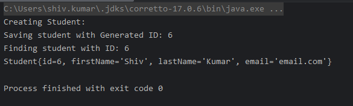


<br>

# 🧠 3.9 Querying Objects with JPA

* We have seen how to retrieve a single object with JPA, we shall now look how to retrieve multiple objects using ❗**JPA Query Language**❗

* 🎃The JPA Query Language is a syntax for retrieving objects based on entity name and entity fields. It's similary conceptionally to SQL with where, like, join, ... etc🎃

## 🟦 Example 1

* Here's how we would write a JPQL statement for retrieving all Students in our `student` table:

```java
TypedQuery<Student> theQuery = entityManager.createQuery("FROM student", Student.class);
List<Student> students = theQuery.getResultList();
```

* ⚠️The student within the query does NOT correspond to the database table of the same name⚠️

## 🟦 Example 2

*  Here's how we can filter results from a query:

```java
TypedQuery<Student> query = entityManager.createQuery(
	"FROM Student WHERE lastName='Kumar'", Student.class)
List<Student> students = query.getResultList();
```

## 🟦 JPQL - Named Parameters

* 🎃Named parameters allows us to programatically use values within the JPQL query!🎃

* We prefix the named parameters with a colon in our query!

* E.g. let's use a method parameters as a named parameter:

```java
public List<Student> findByLastName(String theLastName){
	TypedQuery<Student> query = entityManager.createQuery(
		"FROM Student WHERE lastName=:theData", Student.class);
	query.setParameter("theData", theLastName);
	return query.getResultList();
}
```

## 👨‍💻 Coding Demo 1 👨‍💻

* I update the `StudentDAO` interface:

```java
public interface StudentDAO {
    void save(Student student);
    Student findById(Integer id);
    List<Student> findAll(); // new method
}
```

* I implement the method in `StudentDAOImpl`:

```java
@Repository
public class StudentDAOImpl implements StudentDAO {

    // ...

    @Override
    public List<Student> findAll() {
        return entityManager.createQuery("FROM Student").getResultList();
    }
}
```


* I then update the `CrudDemoApplication`:

```java
@SpringBootApplication
public class CrudDemoApplication {

	public static void main(String[] args) {
		SpringApplication.run(CrudDemoApplication.class, args);
	}

	@Bean
	public CommandLineRunner commandLineRunner(StudentDAO studentDAO){
		return runner -> {
			// saveStudent(studentDAO);
			// createMultipleStudents(studentDAO);
			// findStudent(studentDAO);
			queryStudents(studentDAO);
		};
	}

	private void queryStudents(StudentDAO studentDAO) {
		System.out.println("Querying all students");
		List<Student> list = studentDAO.findAll();
		list.forEach(s -> System.out.println(s));
	}
	// ...
}
```

* Running the application:

	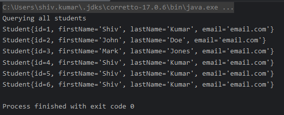

## 👨‍💻 Coding Demo 2 👨‍💻

* I create a new method in the `StudentDAO` interface which will use a named parameter:

```java
public interface StudentDAO {
    void save(Student student);
    Student findById(Integer id);
    List<Student> findAll();
    List<Student> findByLastName(String lastName); // new method
}
```

* I implement this method as:

```java
@Repository
public class StudentDAOImpl implements StudentDAO {
	// ....
    @Override
    public List<Student> findByLastName(String lastName) {
        TypedQuery<Student> query = entityManager.createQuery(
                "FROM Student WHERE lastName=:lastName", Student.class);
        query.setParameter("lastName", lastName);
        return query.getResultList();
    }
}
```

* I update the code in the `CrudDemoApplication`:

```java
@SpringBootApplication
public class CrudDemoApplication {

	public static void main(String[] args) {
		SpringApplication.run(CrudDemoApplication.class, args);
	}

	@Bean
	public CommandLineRunner commandLineRunner(StudentDAO studentDAO){
		return runner -> {
			// saveStudent(studentDAO);
			// createMultipleStudents(studentDAO);
			// findStudent(studentDAO);
			// queryStudents(studentDAO);
			queryStudentsByLastName(studentDAO);
		};
	}

	private void queryStudentsByLastName(StudentDAO studentDAO){
		System.out.println("Querying students by last name:");
		List<Student> students = studentDAO.findByLastName("Kumar");
		students.forEach(System.out::println);
	}
}
```

* Running the application:

	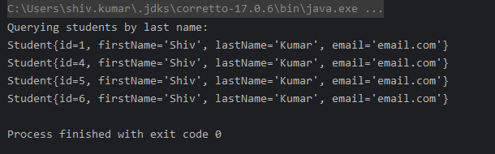


<br>

# 🧠 3.10 Updating Objects with JPA

* We can update a row inside of a table in DB by calling `entityManager.merge(object)` - this will update an object based on the primary key

* If we want to update multiple rows in the DB, we must create a query and call the `executeQuery()` method on it. This will return the number of rows updated:

```java
// updating an existing row:
Student student = entityManager.find(Student.class, 1);
student.setLastName("Kumar");
entityManager.merge(student);

// updating multiple rows:
int numberOfRowsUpdate = entityManager.createQuery(
	"UPDATE Student SET lastName='test'")
	.executeUpdate();
```

## 👨‍💻 Coding Demo 👨‍💻

* I add `UpdateStudent()` to the StudentDAO

```java
public interface StudentDAO {
    void save(Student student);
    Student findById(Integer id);
    List<Student> findAll();
    List<Student> findByLastName(String lastName);
    void UpdateStudent(Student theStudent); // new method
}
```

* I then implement the method in `StudentDAOImpl`:

```java
@Repository
public class StudentDAOImpl implements StudentDAO {
	// ...
    @Transactional
    public void UpdateStudent(Student theStudent) {
        entityManager.merge(theStudent);
    }
}
```

* I then update `CrudDemoApplication`:

```java
@SpringBootApplication
public class CrudDemoApplication {

	public static void main(String[] args) {
		SpringApplication.run(CrudDemoApplication.class, args);
	}

	@Bean
	public CommandLineRunner commandLineRunner(StudentDAO studentDAO){
		return runner -> {
			// saveStudent(studentDAO);
			// createMultipleStudents(studentDAO);
			// findStudent(studentDAO);
			// queryStudents(studentDAO);
			// queryStudentsByLastName(studentDAO);
			updateStudent(studentDAO);
		};
	}

	private void updateStudent(StudentDAO studentDAO) {
		int studentId = 1;
		System.out.println("Finding student with id: "+studentId);

		Student student = studentDAO.findById(studentId);
		System.out.println("Found student: "+student.toString());

		System.out.println("Updating name to scooby: ");
		student.setLastName("Scooby");
		System.out.println(student.toString());

		System.out.println("Updating row in DB");
		studentDAO.UpdateStudent(student);

		System.out.println("Retrieving student:");
		System.out.println(studentDAO.findById(studentId).toString());
	}
	// ...
}
```

* Running the application:

	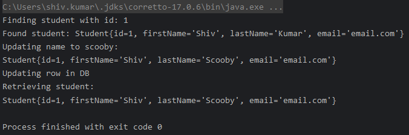

<br>

# 🧠 3.10 Updating Objects with JPA

* We can delete a row from the DB by calling `entityManager.remove(object)`.

* If we wanted to delete multiple row, then we need to create a query and call `executeUpdate()`:

```java
int numRowsDeleted = entityManager
					.createQuery("DELETE FROM Student WHERE lastName='Kumar'")
					.executeUpdate();
```

## 👨‍💻 Coding Demo 👨‍💻

* I add a new method to `StudentDAO` interface:

```java
public interface StudentDAO {
    void save(Student student);
    Student findById(Integer id);
    List<Student> findAll();
    List<Student> findByLastName(String lastName);
    void UpdateStudent(Student theStudent);
    void delete(Integer studentId); // new method
}
```

* I implement the method as:

```java
    @Override
    @Transactional
    public void delete(Integer studentId) {
        Student student = entityManager.find(Student.class, studentId);
        entityManager.remove(student);
    }
```

* I update the `CrudDemoApplication`:

```java
@SpringBootApplication
public class CrudDemoApplication {

	public static void main(String[] args) {
		SpringApplication.run(CrudDemoApplication.class, args);
	}

	@Bean
	public CommandLineRunner commandLineRunner(StudentDAO studentDAO){
		return runner -> {
			// saveStudent(studentDAO);
			// createMultipleStudents(studentDAO);
			// findStudent(studentDAO);
			// queryStudents(studentDAO);
			// queryStudentsByLastName(studentDAO);
			// updateStudent(studentDAO);
			deleteStudent(studentDAO);
		};
	}

	private void deleteStudent(StudentDAO studentDAO) {
		Integer studentId = 1;
		System.out.println("Deleting student with ID: "+studentId);
		studentDAO.delete(studentId);
		boolean studentIsDeleted = studentDAO.findById(studentId) == null;
		System.out.println("Student is deleted: "+studentIsDeleted);
	}
	// ....
}
```

* Running the application:

	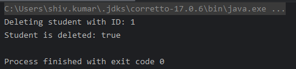

# 🧠 3.1 H1

## 🟦 H2
✅
❗
❌
🤔
⚠️
😊 
😱

* 🎃DEFINITION🎃


