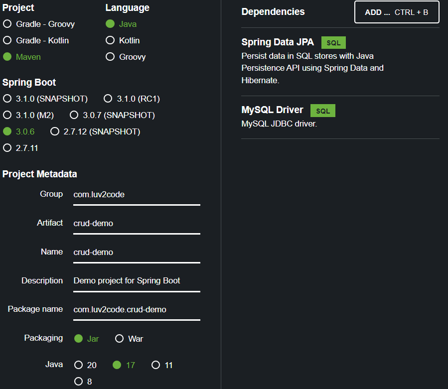
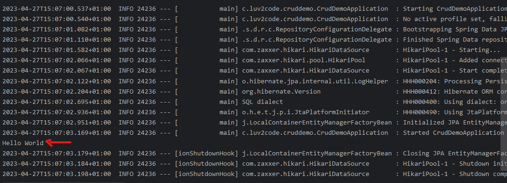

<link rel="stylesheet" href="../style.css" />

# 🟪 Section 3 - Spring Boot 3 - Database Access with Hibernate/JPA CRUD

# 🧠 3.1 Introduction

## 🟦 Overview

We shall go through the following topics:

1) What is Hibernate? 🤔

2) Benefits of Hibernate 😊 

3) What is JPA? 🤔

4) Benefits of JPA 😊 

## 🟦 What is Hibernate? 🤔

* 🎃 **Hibernate is a framework for persisting Java objects to a database** 🎃

* It's a very popular framework used by enterprise applications:


## 🟦 Benefits of Hibernate 😊

* Handles all low level SQL code ✅
* Minimises amount of JDBC code needed ✅
* It provides the Object-to-Relational Mapping (ORM) ✅

## 🟦 How does Hibernate work?? 🤔

* The developer simply defines the mapping between the Java class and database table:


* These mappings can be made through XML, Java code or annotations

## 🟦 What is JPA? 🤔

* 🎃 **JPA is Jakarta Persistence API (previously Java Persistence API). It defines a set of interfaces and acts as a standard API for ORM** 🎃

* JPA Vendor Implementations are frameworks which provide implementation for JPA. Hibernate and EclipseLink are both JPA implementations

## 🟦 Benefits of JPA 😊

* A standard API means you are not locked to a specific vendor, so you can switch implementations✅
* This maintains portability and flexibility of code ✅
* It provides the Object-to-Relational Mapping (ORM) ✅


## 🟦 Saving Java Object with JPA 🤔

* Here's some code to persist to the database:

```java
// create Java object
Student student = new Student("Shiv", "Kumar", "shiv@email.com");

// save to database
entityManager.persist(student);
```

* The `entityManager` is a JPA helper object which has methods which execute SQL queries on the database❗

## 🟦 Retrieving a Java Object with JPA 🤔

* Here's some code to persist to the database:

```java
// retrieve from database using primary key:
int theId = 1;
Student myStudent = entityManager.find(Student.class, theId);
```

## 🟦 Querying for Java Objects 🤔

* Here's some code for querying Java objects from the DB:

```java
TypedQuery<Student> query = entityManager.query("FROM Students", Student.class);
List<Student> listOfStudents = query.getResultList();
```

## How does Hibernate/JPA relate to JDBC?

* Hibernate/JPA uses JDBC for all database communications, its another layer of Abstraction!

<br>

# 🧠 3.2 Setting Up Database Table

* I download MySQL Server using the Windows installer

 * We shall setup the database using some starter files:

    1) `01.create-user.sql`

    2) `02-student-tracker.sql`

* I take the folder [00-starter-sql-scripts](/00-starter-sql-scripts/) and copy it to a new demo folder ([here](/demo-01-spring-hibernate-jpa-crud/))

* I open up the create user sql in MySQL workbench and executre the script.

* I can see the new user in the admin and privelleges page:

        

* I create a new connection for the springstudent connection, and succesfully test the connection:

    

* I use the new connection, I look at the schema:

    

* I open up the student tracker SQL script and execute it. Checking the schema now:

    

* The database is now setup!!!

<br>

# 🧠 3.3 Setting Up Spring Boot Project

## 🟦 Automatic Data Source Configuration

* ❗Hibernate is the default implementation of JPA❗

* `EntityManager` from JPA is the main component for creating enquiries ✅

* Based on configuration, Spring will create beans for `DataSource` and `EntityManager`

* These can be injected into the app

## 🟦 Setting Up Project

* We shall use Spring Intitialzr to add dependencies for:
    
    - MySQL Driver `mysql-connecter-j` 👷
    - Spring Data JPA `spring-boot-starter-data-jpa` 👷

* Spring Boot will automatically configure data source for you and get the DB connection info from `application.properties` - which will contain url, username and passeword

* We shall make a simple command line app to focus on JPA/Hibernate

## 🟦 Code Demo

* I go to spring initialzr and create the following project:



* I unzip the code folder [here](/demo-01-spring-hibernate-jpa-crud/)

* I open up `CrudDemoApplication`:

```java
@SpringBootApplication
public class CrudDemoApplication {

	public static void main(String[] args) {
		SpringApplication.run(CrudDemoApplication.class, args);
	}

}
```

* I create a new Bean `CommandLineRunner` (from Spring Boot):

```java
@SpringBootApplication
public class CrudDemoApplication {
	public static void main(String[] args) {
		SpringApplication.run(CrudDemoApplication.class, args);
	}
	@Bean
	public CommandLineRunner commandLineRunner(String[] args){
		return runner -> {
			System.out.println("Hello World");
		};
	}
}
```


* I update the `application.properties`:

```properties
# the port number comes from the connection in MySQL
spring.datasource.url=jdbc:mysql://localhost:3306/student_tracker
spring.datasource.username=springstudent
spring.datasource.password=springstudent
```

* We can see that the application is running:

    

* ❗ We can switch off the spring boot banner from displaying in console with an additional property. We can also set the logging level to warn ❗

```properties
# disable spring banner
spring.main.banner-mode=off

# reduce logging level
logging.level.root=warn
```

# 🧠 3.1 H1

## 🟦 H2
✅
❗
❌
🤔
😊 
😱

* 🎃DEFINITION🎃

IMAGE:    


