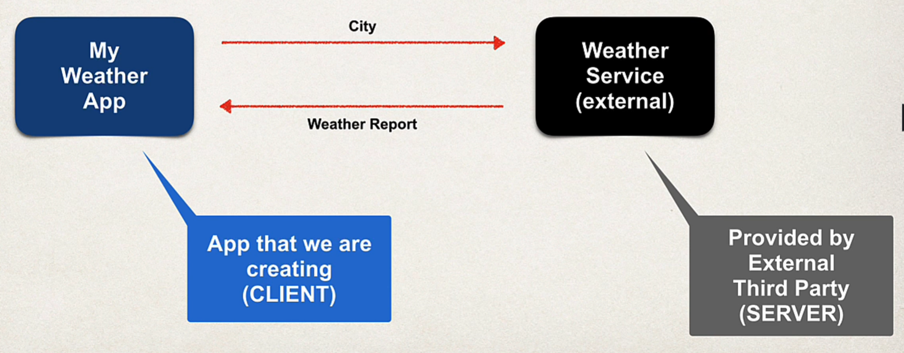
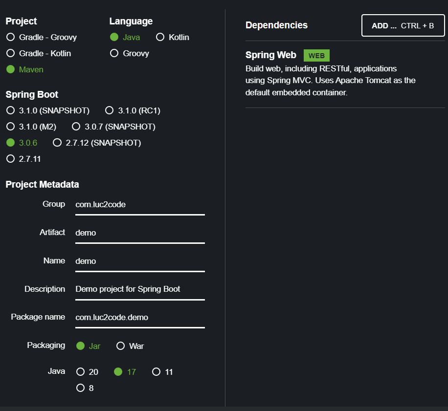
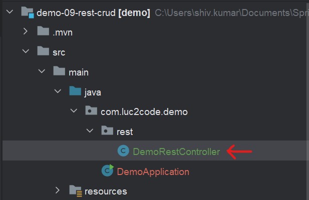
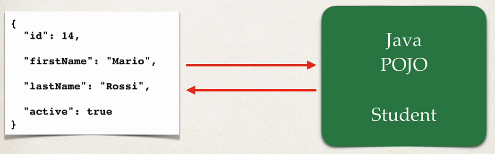
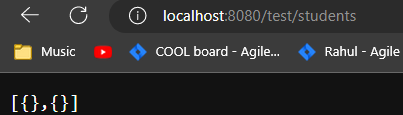
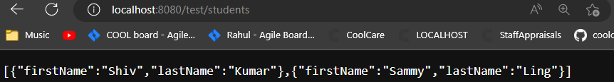
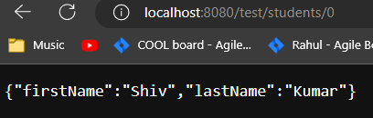
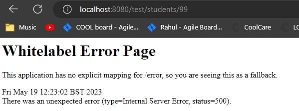

<link rel="stylesheet" href="../style.css" />

# 🟪 Section 4 - Spring Boot 3 - REST CRUD APIs


# 🧠 4.1 Introduction

In this section, we will be doing the following:

* Create REST APIs/Web Services with Spring ✅

* Discuss REST Concepts, JSON, HTTP messaging ✅

* Install Postman (REST Client Tool) ✅

* Develop REST APIs using `@RestController` ✅

* Build CRUD Interface to the database with Spring REST ✅

This will act as an introduction to Spring REST developmebt

<br>

# 🧠 4.2 REST Services

## 🟦 Coding scenario

* Business Problem: build a client an app which produces weather report for the city. The weather data is retrieved from an external service

* The application will have the following architecture:

    

* Questions include how will we connect to weather service 🤔 what programming language 🤔 what data format 🤔

## 🟦 Solution! 

* 😊 We can connect to the weather service using REST API calls over HTTP 😊

* 😊 REST is **language independent**, so we could use any programming language for the app and server! 😊

* 😊 We can use JSON but REST applications can yuse ANY data format 😊

## 🟦 Weather Service

* We can use a Weather service API using [openweathermap.org](www.openweathermap.org)

* We can make calls to the API using a city name as seen in its documentation:

```
api.openweathermap.org/data/2.5/weather?q={cityName}
api.openweathermap.org/data/2.5/weather?q={cityName},{countryCode}
```
## 🟦 Weather Service - Response

* The weather service responds in form of JSON. This would have the following format:

```json
{
    ...
    "temp": 14,
    "temp-min": 11,
    "temp-max": 11,
    "name": "London",
    ...
}
```

* Since the weather service returns data in a language format, we could create multiple client apps using Spring MVC, C#, iPhone... 😱

* REST APIs go under multiple names including RESTful web services, Rest services, ... etc


<br>

# 🧠 4.3 Spring Boot REST HTTP Basics

## 🟦 HTTP Methods

* Most common use of REST is over HTTP, so we can leverage HTTP methods for CRUD operation

| HTTP Method | CRUD Operation |
|-------------|----------------|
| `POST`      | Create a new entity |
| `GET`       | Get a list of entities or a single entity |
| `PUT`       | Update an existing entity |
| `DELETE`    | Delete an existing entity |

* We will send a HTTP Request Message to the server from the app, the server then sends a HTTP Response Message

## 🟦 HTTP Request Message

* A HTTP Request message consists of:

1) Request Line - the HTTP command

2) Header variables - metadata of request

3) Message body - content of the message (this can be in the form of JSON)

## 🟦 HTTP Response Message

* The Response Message consists of:

1) Response line: server protocol/status code

2) Header variables: metadata of response

3) Message body: contents of the message

* The HTTP Response Status codes consist of:

|  Code Range | Description |
|------------|--------------|
| 100-199    | Informational |
| 200-299    | Success      |
| 300-399    | Redirection |
| 400-499    | Client Error |
| 500-599    | Server Error |

## 🟦 MIME Content Types

* MIME - Multipurpose Internet Mail Extension, desribes the messagee format.

* The syntax for this is `type/sub-type`, e.g. `text/html`, `text/plain` etc


## 🟦 Client Tool

* We need a tool to sent HTTP requests to the HTTP REST Service❗ There are multiple client tools available like Postman, Curl, ...

* This course will use Postman!!! I download Postman from [here](https://www.postman.com/downloads/)

<br>

# 🧠 4.4 Postman Demo

* I open a new tab in Postman and see this:

  

* I visit **JSONPlaceholder** ([link](https://jsonplaceholder.typicode.com/)), which has URLs which return dummy JSON data

* I use this URL which returns some users JSON: [https://jsonplaceholder.typicode.com/users](https://jsonplaceholder.typicode.com/users)

* I make a GET request using the above link and see a list of JSON objects in Postman:

    

<br>


# 🧠 4.5 Spring REST Controller

## 🟦 Coding Scenario

* We want to write a REST service such that when it gets a request for `/test/hello`, it sends a response to the client with `Hello World!`

* We can define a REST Controller on a class:

```java
@RestController
@RequestMapping("/test")
public class DemoRestController {

    @GetMapping("/hello")
    public String sayHello(){
        return "Hello World!";a
    }
}
```

* We can test our web service using the browser or Postman - Postman would be the best option when you have more complicated requests, have authentication, ... 

## 🟦 Coding Demo

* We need the following dependency to create a RESTful service:

```xml
<dependency>
    <groupId>org.springframework.boot</groupId>
    <artifactId>spring-boot-starter-web</artifactId>
</dependency>
```

* I go to the Spring Initializr websit and setup the project:

    


* I create a new project [here](/Section%203%20-%20REST%20CRUD%20APIs/Demo%2014%20-%20Spring%20Rest%20Controller/demo-09-rest-crud/) and create a class in this package:

    

* I write the class as:

```java
@RestController
@RequestMapping("/test")
public class DemoRestController {

    @GetMapping("/hello")
    public String sayHello(){
        return "Hello World!";
    }
}
```

* I run the Spring application and navigate to the endpoint:

    

* The app works as expected!


<br>


# 🧠 4.6 Java JSON Data Binding

## 🟦 What is Data binding?

* 🎃Data binding is the process of converting JSON data to Java POJO (and reverse)🎃

* This is also know as serialisation/deserialisation or Mapping

* Spring used the Jackson Project which handles the databinding by calling the appropiate getter/setter method:



* When mapping from the JSON, Jackson calls the setX() method on the class - it does not access properties directly!

* When mapping from the JSON, Jackson calls the getX() method on the class

* Spring automatically handles Jackson Integration!

<br>


# 🧠 4.7 Spring Boot REST POJO

* We shall create a REST endpoint `/api/students/` which returns a list of students

* We will need to convert the Java List into a JSON. Spring Boot automatically converts the Java POJO as JSON using Jackson

## 👨‍💻 Coding Demo 👨‍💻

* I defined a `Student` class as:

```java
@Component
public class Student {

    private String firstName;
    private String lastName;

    public Student(){}

    public Student(String firstName, String lastName){
        this.firstName = firstName;
        this.lastName = lastName;
    }

    @Override
    public String toString() {
        return "Student{" + "firstName='" + firstName + '\'' + ", lastName='" + lastName + '\'' + '}';
    }
}
```

* I created a new end-point in my `DemoRestController`:

```java
@RestController
@RequestMapping("/test")
public class DemoRestController {

    @GetMapping("/hello")
    public String sayHello(){
        return "Hello World!";
    }

    @GetMapping("students")
    public List<Student> getStudents(){
        return Arrays.asList(new Student("Shiv", "Kumar"), new Student("Sammy", "Ling"));
    }
}
```

* Opening up my browser, I get the following:



* I realise that it's not working because I have no setters/getters😱 

* After adding the setters/getters, the app starts working:

```java
@Component
public class Student {
    private String firstName;
    private String lastName;
    public Student(){}
    public Student(String firstName, String lastName) {
        this.firstName = firstName; this.lastName = lastName; }
    public String getFirstName() {
        return firstName; }
    public void setFirstName(String firstName) {
        this.firstName = firstName; }
    public String getLastName() {
        return lastName; }
    public void setLastName(String lastName) {
        this.lastName = lastName; }
    @Override
    public String toString() {
        return "Student{" + "firstName='" + firstName + '\'' + ", lastName='" + lastName + '\'' + '}'; }
}
```




<br>


# 🧠 4.8 Spring Boot REST Path Variables

* We can use refactor our code, so that we are not recreating a list of students over and over again. We create a private field in our `DemoRestController` and created a method which initialises this field:

```java
@RestController
@RequestMapping("/test")
public class DemoRestController {

    private List<Student> theStudents;

    @PostConstruct
    public void loadDate() {
        theStudents = Arrays.asList(
                new Student("Shiv", "Kumar"),
                new Student("Sammy", "Ling"),
                new Student("Rohan", "Verma"));
    }
    @GetMapping("/hello")
    public String sayHello(){
        return "Hello World!";
    }
    @GetMapping("students")
    public List<Student> getStudents(){
        return theStudents;
    }
}
```

* I used the `@PostConstruct` annotation so that the method is only executed once after the class has been constructed!

* We can use path variables which let us extract variables from the URL! Suppose we wanted to return a specific student.

* I create a Get mapping in the `DemoRestController`:

```java
    @GetMapping("/students/{studentId}")
    public Student getStudent(@PathVariable int studentId){
        return theStudents.get(studentId);
    }
```

* The path variable works:



* Suppose we make a call which exceeds the index of the List:



## 👨‍💻 Coding Demo 👨‍💻

* Our Rest controller instantiates a list of Students each time the /students endpoint is called:

```java
@RestController
@RequestMapping("/api")
public class StudentRestController {
    // define end point for students
    @GetMapping("/students")
    public List<Student> getStudents() {
        return Arrays.asList(
                new Student("Shiv", "Kumar"),
                new Student("Rohan", "Verma")
        );
    }
}
```

* I will utitlise the `@PostConstruct` annotation and use it to initialise the list exactly once! I create a private field for the students which will get initialised:

```java
@RestController
@RequestMapping("/api")
public class StudentRestController {

    private List<Student> studentsList;

    // the studentList will get initialised exactly once!
    @PostConstruct
    public void loadStudentsData() {
        studentsList = Arrays.asList(
                new Student("Shiv", "Kumar"),
                new Student("Rohan", "Verma")
        );
    }

    // define end point for students
    @GetMapping("/students")
    public List<Student> getStudents() {
        return studentsList;
    }
}
```


* 🎃DEFINITION🎃

## 🟦 H2

IMAGE:    

CHECKBOX ✅

CROSS  ❌
