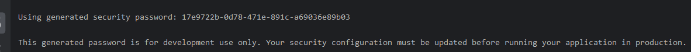
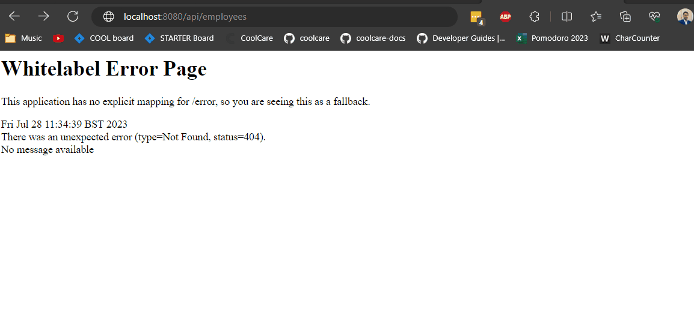

<link rel="stylesheet" href="../style.css" />

# 🟪 Section 5 - Spring Boot 3 - REST API Security

# 🧠 5.1 Spring Boot REST API Security

## 🟦 Overview

In this section I will learn how to:
1) secure Spring Boot REST APIs
2) Define users and roles
3) Protect URLs based on role
4) Store users, password and roles in DB using encryption

### 🔴 The Spring Security Model

* Spring Security defines a framework which is implemented using Servlet filters in the background
* We can secure the app declaratively and programatically!


### 🔴 Servlet Filters

* Servlet Filters are used to pre-process/post-process web requests
* These can route web requests based on security logic
* Spring provides most of security functionality using servlet filters!

### 🔴 How does it work?

* In order for a user to access a protected resource, Spring will first check if user is AUTHENTICATED (makes them login if not), then checks if user is authorised (access denied if not) and then shows the resource!


### 🔴 Declarative vs Programatic Security

* In declarative security, we specify the constaints in a configuration file (using `@Configuration`)

* In programatic security, we define custom coding to manage security (which spring offers in its Security API)

### Enabling Spring Security

* We need the following dependency in our `pom.xml` to include Spring security:

```xml
<dependency>
    <groupId>org.springframework.boot</groupId>
    <artifactId>spring-boot-starter-security</artifactId>
</dependency>
```

* Now all endpoints require a login. Spring provides a default login with username `user` and a password generated in console log!

* We can override this default user by specifying the `application.properties` as:

```properties
spring.security.user.name = shiv
spring.security.user.password = password
```

## 👨‍💻 Coding Demo 👨‍💻

* I refresh my database!

* I unzip a project from the resources section and add it to this section as [demo-01-spring-security](/Section%205%20-%20Spring%20REST%20API%20Security/demo-01-spring-security/)


* I add the maven dependency to my pom:

```xml
<dependency>
    <groupId>org.springframework.boot</groupId>
    <artifactId>spring-boot-starter-security</artifactId>
</dependency>
```

* I run my application and get the password from the console: 


* I navigate to `localhost:8080/api/employees`:



* I override the default user/password for convience in my `application.properties`:

```properties
spring.security.user.name = shiv
spring.security.user.password = passwordS
```