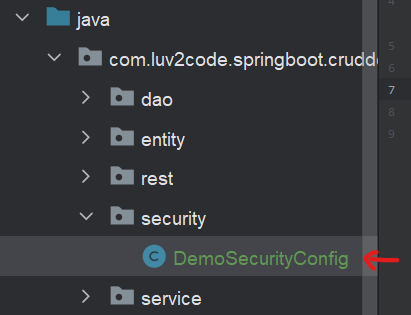
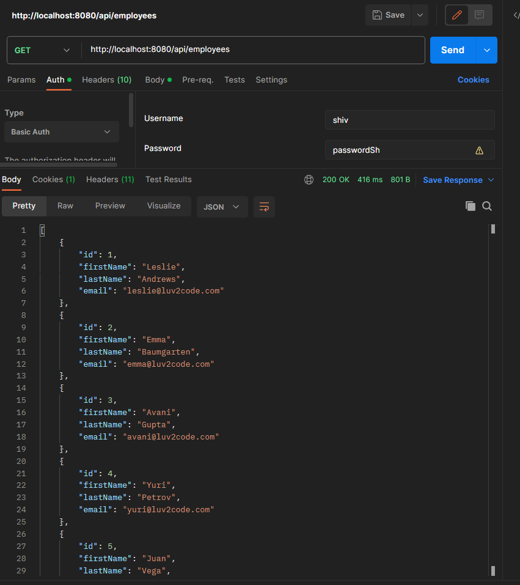

<link rel="stylesheet" href="../style.css" />

# 🟪 Section 5 - Spring Boot 3 - REST API Security

# 🧠 5.1 Spring Boot REST API Security

## 🟦 Overview

In this section I will learn how to:
1) secure Spring Boot REST APIs
2) Define users and roles
3) Protect URLs based on role
4) Store users, password and roles in DB using encryption

### 🔴 The Spring Security Model

* Spring Security defines a framework which is implemented using Servlet filters in the background
* We can secure the app declaratively and programatically!


### 🔴 Servlet Filters

* Servlet Filters are used to pre-process/post-process web requests
* These can route web requests based on security logic
* Spring provides most of security functionality using servlet filters!

### 🔴 How does it work?

* In order for a user to access a protected resource, Spring will first check if user is AUTHENTICATED (makes them login if not), then checks if user is authorised (access denied if not) and then shows the resource!


### 🔴 Declarative vs Programatic Security

* In declarative security, we specify the constaints in a configuration file (using `@Configuration`)

* In programatic security, we define custom coding to manage security (which spring offers in its Security API)

### 🔴 Enabling Spring Security

* We need the following dependency in our `pom.xml` to include Spring security:

```xml
<dependency>
    <groupId>org.springframework.boot</groupId>
    <artifactId>spring-boot-starter-security</artifactId>
</dependency>
```

* Now all endpoints require a login. Spring provides a default login with username `user` and a password generated in console log!

* We can override this default user by specifying the `application.properties` as:

```properties
spring.security.user.name = shiv
spring.security.user.password = password
```

## 👨‍💻 Coding Demo 👨‍💻

* I refresh my database!

* I unzip a project from the resources section and add it to this section as [demo-01-spring-security](/Section%205%20-%20Spring%20REST%20API%20Security/demo-01-spring-security/)


* I add the maven dependency to my pom:

```xml
<dependency>
    <groupId>org.springframework.boot</groupId>
    <artifactId>spring-boot-starter-security</artifactId>
</dependency>
```

* I run my application and get the password from the console: 


* I navigate to `localhost:8080/api/employees`:


* I override the default user/password for convience in my `application.properties`:

```properties
spring.security.user.name = shiv
spring.security.user.password = passwordS
```


# 🧠 5.2 Configuring Basic Security

## 🟦 Overview

* We can create a configuration for our security by creating a class with `@Configuration`:

```java
@Configuration
public class DemoSecurityConfig {
    // config here
}
```

* We can specify how our password is stored, we have `noop` which store plain text📝 and `bcrypt` which is a sophisticated encryption which uses salting and hashing.

* If we are specifying passwords, we must specify the encryptionId like `{id}myPassword` - e.g.: `{bcrypt}myPassword`

## 👨‍💻 Coding Demo 👨‍💻

* I create a new class in a new `security` package:



* I define it as:

```java
@Configuration
public class DemoSecurityConfig {
    @Bean
    public InMemoryUserDetailsManager() {
        UserDetails shiv = User.builder()
                .username("shiv")
                .password("{noop}passwordSh")
                .roles("EMPLOYEE")
                .build();
        UserDetails mary = User.builder()
                .username("mary")
                .password("{noop}passwordMa")
                .roles("EMPLOYEE", "MANAGER")
                .build();
        UserDetails susan = User.builder()
                .username("susan")
                .password("{noop}passwordSu")
                .roles("EMPLOYEE", "MANAGER", "ADMIN")
                .build();
        return new InMemoryUserDetailsManager(shiv, susan, mary);
    }

}
```

* I use Postman to make a get request for the employees and use basic authentication to provide my login details:



* I successfully get a JSON response with the employees table!

* I obtain the same result when using susan or mary's login!


# 🧠 5.3 Restrict Access Based on Roles

## 🟦 Overview

* Let's refine our criteria for out REST API such that certain URL/HTTP requests are restricted depending on role:

| Http Method  | Endpoint   | Role |
| -------------| -----------| ------|
| GET          | `/api/employees` | `EMPLOYEE` |
| GET          | `/api/employees/{employeeId}` | `EMPLOYEE` |
| POST | `/api/employees` | `MANAGER` |
| PUT | `/api/employees` | `MANAGER` |
| DELETE | `/api/employees/{employeeId}` | `ADMIN` |

* We can achieve this using the `requestMatcher()` method:

```java
requestMatchers(HttpMethod method, String url).
.hasRole(String role)

requestMatchers(HttpMethod method, String url).
.hasAnyRoleRole(String... roles)
```

## 🟦 Cross Site Request Forgery (CSFR)

* Spring Security can protect against CSRF attacks which attempt to embed additional authentication data/token to all HTML forms
* Generally CSRF protection is not needed for REST APIs which use Http request and/or PATCH. We can disable this protection with the following:

```java
http.csrf(csrf -> csrf.disable());
```

## 👨‍💻 Coding Demo 👨‍💻

* Currently my `DemoSecurityConfig` class looks like:

```java
@Configuration
public class DemoSecurityConfig {
    @Bean
    public InMemoryUserDetailsManager userDetailsManager() {
        UserDetails shiv = User.builder()
                .username("shiv")
                .password("{noop}passwordSh")
                .roles("EMPLOYEE")
                .build();
        UserDetails mary = User.builder()
                .username("mary")
                .password("{noop}passwordMa")
                .roles("EMPLOYEE", "MANAGER")
                .build();
        UserDetails susan = User.builder()
                .username("susan")
                .password("{noop}passwordSu")
                .roles("EMPLOYEE", "MANAGER", "ADMIN")
                .build();
        return new InMemoryUserDetailsManager(shiv, susan, mary);
    }
}
```

* I create a new Bean:

```java
@Bean
public SecurityFilterChain filterChain(HttpSecurity http) throws Exception{
    http.authorizeHttpRequests(configurer ->
        configurer
          .requestMatchers(HttpMethod.GET, "/api/employees").hasRole("EMPLOYEE")
          .requestMatchers(HttpMethod.GET, "/api/**").hasRole("EMPLOYEE")
          .requestMatchers(HttpMethod.POST, "/api/employees").hasRole("MANAGER")
          .requestMatchers(HttpMethod.PUT, "/api/employees").hasRole("MANAGER")
          .requestMatchers(HttpMethod.DELETE, "api/employees/**").hadRole("ADMIN")
    );
    // use basic authentication:
    http.httpBasic(Customiser.withDefaults());
    // disable 
    http.csrf(customiser -> customiser.disable());
    return http.build();
}
```

* I use wilcards (**) in the URLs so that the security is applied to all URLs which match that pattern!

* I verify that I am only able to delete employees with Susan's login details!